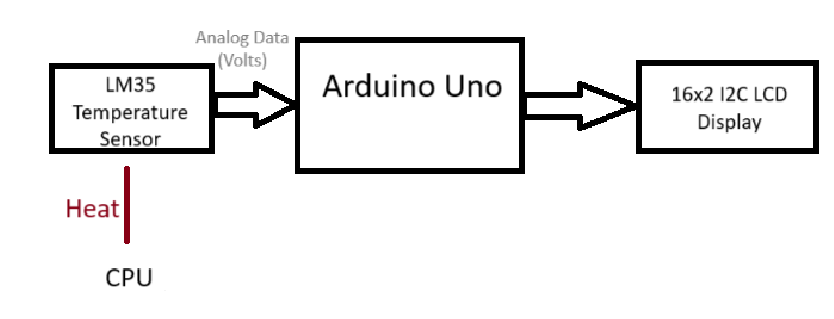

# cpu-temprature-monitor
 An Arduino Based system that uses analog sensor to monitor CPU temperature.

Simple Project that demonstrates embedded systems being applied in the real world.

## Skills Utilized

Analog Signals, Analog to Digital Conversion, I2C Serial Communication.

## Parts List:

-Arduino Uno
-USB Cable
-LM35 Temperature Sensor
-16x2 I2C LCD Display
-Jumper Wires
-Breadboard

## Visual Diagrams

-System Level Diagram:

-Tinkercad Visual:

-[Tinkercad Diagram](Docs/tinkercad_diagram.png)

## Internal Workings

1. The LM35 Temperature sensor sends an analog output as a voltage.
	NOTE: Voltage is proportional to the temperature read by the sensor.
2. The Arduino Uno then uses its 10-bit ADC to sample the analog voltage signal from LM35.
3. The voltage is then converted to degrees Celsius.
	NOTE: The LM35 outputs 10mV per degree Celsius.
4. The resulting number in degrees Celsius is displayed via the LCD display.

## How To Implement (Hardware)

1. Start by uploading the 'cpu_temp_monitor.ino' code to the Arduino Uno.
2. Connect the LM35 sensor pins using the jumper wires to the Arduino:
	-Vout -> A0
	-Vcc -> 5V
	-GND -> GND
3. Connect the I2C 16x2 LCD pins to the Arduino:
	-Vcc -> 5V
	-GND -> GND
	-SDA -> PIN above AREF
	-SCL -> 2 PINS above AREF
4. Place LM35 externally on a running CPU.
5. Observe real-time readings on LCD display.

## Software Component

1. Since the 16x2 LCD Display uses I2C serial communication, the LCD needs to be initialized correctly. **Addressing is very important, typically the default address is (0x27) for I2C, but can vary**
2. For the ADC, a function needs to take the read the analog temperature and convert it using some math to a Celsius reading **Remember LM35 outputs 10mV per degree Celsius**

Reference the code snippets for additional clarification!

## Takeaways

-Reading and Scaling analog data with A0 ADC pin on Arduino Uno
-How the LM35 functions as an analog temperature sensor
-I2C serial protocol, making it readable and valid

## Future Improvements

-Create a graph that displays temperature in real time from a serial monitor on a computer.
-Create a storage card module that can collect data over longer periods of time
-Create a mechanism that can lock onto the CPU ensuring more accurate results.
-A stretch: Find a way to get a temperature sensor inside of older CPUs, that do not already have one embedded inside. 

## Notes

-This GitHub Repository was created to learn the fundamentals of GitHub through transferring this Arduino Project over to this platform.
-The initial Arduino Uno CPU Temperature Sensor was a personal project completed by Ryan Miller in December 2024.
-The inspiration for the initial project was from angadiameya007 on Arduino Project Hub as they monitored CPU temperature with an OLED display and a Raspberry Pi.

